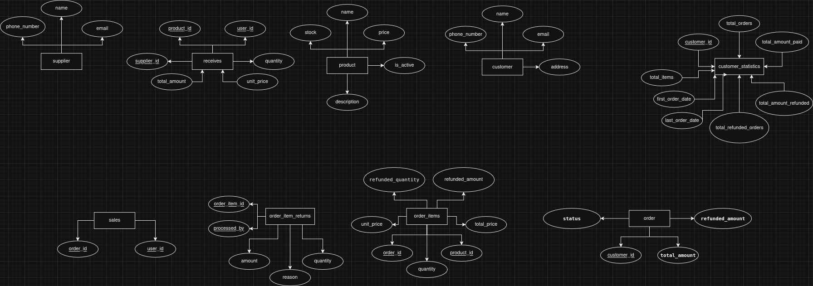

# Simple Order Management System

A **Simple Order Management System** built with **Laravel 12** and **MySQL**, designed to manage customers, products, and orders efficiently. This project was completed as a technical assessment for **SIDEUP**.

---

## Project Overview

This system allows users to:

-   Manage **customers** (CRUD + search/filter)
-   Manage **products** (CRUD + stock management + pagination)
-   Create and manage **orders** (select customer & products, update stock, etc...)
-   View **reports & dashboard** (total orders, revenue, top 5 customers)
-   And more...

Additionally, the project includes a **Filament Admin Dashboard** for enhanced usability.

---

## Database

-   ERD created for all entities
-   Laravel Migrations and Seeders included
-   Tables:



---

## Screenshots

<div align="center">

<table>
  <tr>
    <td></td>
    <td></td>
    <td></td>
  </tr>
  <tr>
    <td></td>
    <td></td>
    <td></td>
  </tr>
  <tr>
    <td></td>
    <td></td>
    <td></td>
  </tr>
  <tr>
    <td></td>
    <td></td>
    <td></td>
  </tr>
  <tr>
    <td></td>
    <td></td>
    <td></td>
  </tr>
</table>

</div>

---

## Features

### Authentication

-   Protected routes for authenticated users
-   Role-based access (Admin/Staff) implemented

### Suppliers Management

-   CRUD operations
-   Search/filter

### Customer Management

-   CRUD operations
-   Search/filter

### Product Management

-   CRUD operations (name, price, stock)
-   Pagination for product listing

### Receives Management

-   CRUD operations
-   Pagination for product listing

### Sale Management

-   CRUD operations
-   Pagination for product listing

### Order Management

-   Create orders with multiple products
-   Automatically decrease product stock when sale or receive
-   View order details (customer, items, total)
-   Refound order or partial refund (restock)

### Reporting & Dashboard

-   Dashboard showing:
    -   Total orders
    -   Total revenue
    -   Top 5 customers
-   Filament Admin Panel integration

---

## Technical Stack

-   **Backend:** Laravel 12, PHP 8+
-   **Database:** MySQL
-   **ORM:** Eloquent
-   **Frontend:** Filament Admin Panel
-   **Architecture:** MVC
-   **Authentication:** Laravel Sunctom
-   **Validation:** Form Requests
-   **Deployment-ready:** Environment variables via `.env`

---

## Installation & Setup

1. **Clone the repository**

    ```bash
    git clone https://github.com/TarekHesham/simple-order-managment-system.git
    cd simple-order-managment-system
    ```

2. **Install dependencies**

    ```bash
    composer install
    ```

3. **Configure environment**

    ```bash
    cp .env.example .env
    php artisan key:generate
    ```

    Update `.env` with your database credentials.

4. **Run migrations & seeders**

    ```bash
    php artisan migrate --seed
    ```

5. **Start the local server**

    ```bash
    php artisan serve
    ```

    Access the app at `http://127.0.0.1:8000/dashboard`

---

## Admin Credentials

Use the following credentials to access the Filament Dashboard:

```
Email: admin@outlook.com
Password: admin
```

---

## Notes

-   All functional requirements completed and tested with `Postman` & `Dashboard`
-   Filament Admin Panel added for better dashboard experience
-   Secure inputs & validation implemented
-   Ready for deployment on shared hosting, Vercel, or Render
